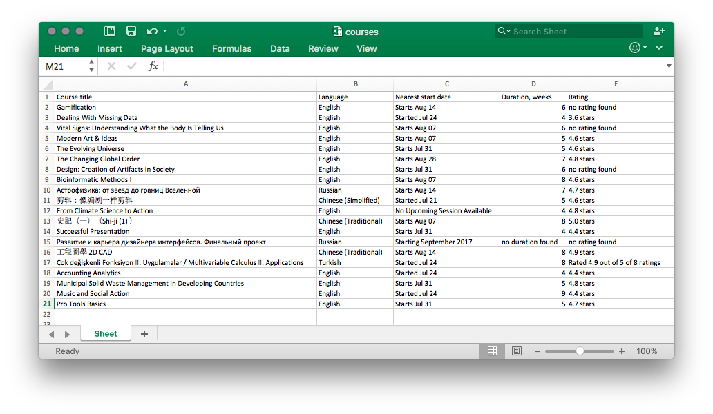

# Coursera Dump

Script loads 20 pages from [coursera xml feed](https://www.coursera.org/sitemap~www~courses.xml). Parses them for course info and saves it into courses.xlsx file.

## Usage
Run this:
```
python coursera.py
```

Get this:


# Project Goals

The code is written for educational purposes. Training course for web-developers - [DEVMAN.org](https://devman.org)
